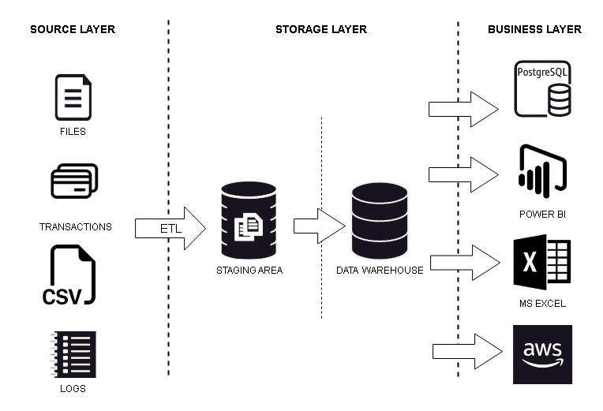
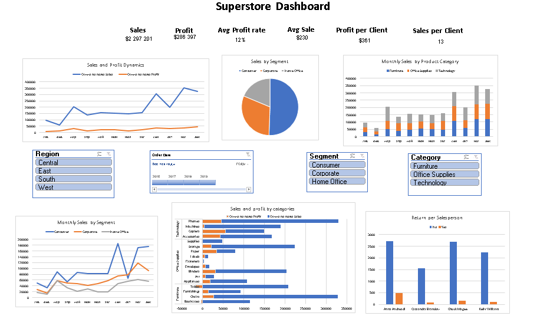

# MODULE 1

## Task 1
Install GitHub and create a repository DE-101 with folder [Module-01](https://github.com/peargrape/DE-101)

## Task 2
Draw high-level architecture of analytic solution for a business 

## Task 3
Create a dashboard using a given table
